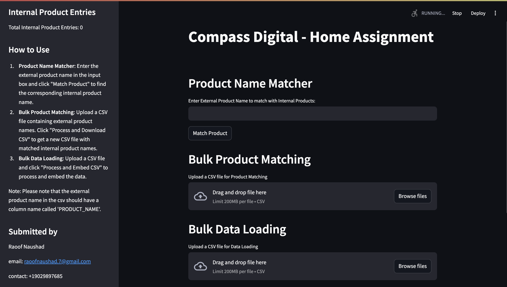
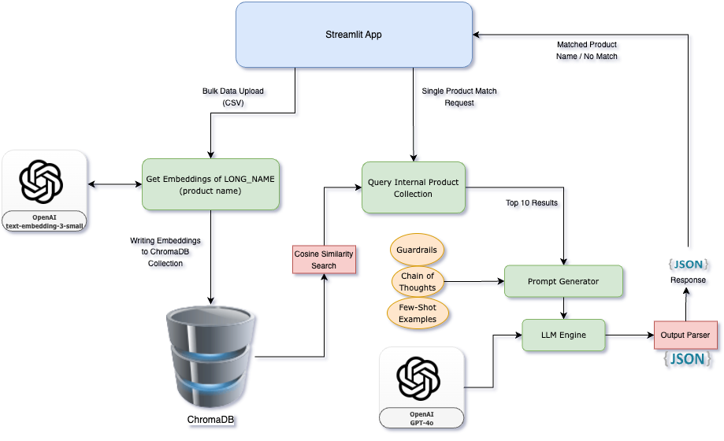

# Compass Digital AI Engineer Take-Home Exercise

## Overview
This project is based on an assignment given by Compass Digital for a full-time position. The goal is to develop an intelligent, automated system to match external products with internal items using a Streamlit-based front-end application.

## Project Summary
Your stakeholder operates convenience-store-like markets and receives weekly shipments from suppliers, including many new products. The current process of mapping the two product lists together is slow and manual. Your goal is to explore the datasets and develop an intelligent, automated system to match external products with internal items. Ensure that your solution includes prompt engineering as part of your tech stack. The match has to be exact, meaning the product manufacturer, name, and size must be identical.

## Deliverables
1. **Final Result**: A table including all external items with the corresponding mapped internal product. If no match is found, the table should indicate NULL for the internal product.
2. **Presentation**: A short presentation to demonstrate how your system works, targeted towards a non-technical audience.
3. **Bonus**: Develop a simple front-end app using Streamlit.

## Setup Instructions
1. **Install Python**: Ensure Python is installed on your system.
2. **Create Virtual Environment**: 
    ```bash
    python -m venv venv
    ```
3. **Activate Virtual Environment**:
    - On Windows:
        ```bash
        .\venv\Scripts\activate
        ```
    - On macOS/Linux:
        ```bash
        source venv/bin/activate
        ```
4. **Install Dependencies**:
    ```bash
    pip install -r requirements.txt
    ```
5. **Run the Application**:
    ```bash
    streamlit run app.py
    ```

## Usage
- **Sidebar**: Displays the total number of internal product entries.
- **Product Name Matcher**: Enter the external product name to find the corresponding internal product name.
- **Bulk Product Matching**: Upload a CSV file containing external product names to get a new CSV file with matched internal product names.
- **Bulk Data Loading**: Upload a CSV file to process and embed the data.

## Application Structure
Refer to `app.py` for a detailed structure of the application.

## Images
### Project UI


### Architecture


## Contact
- **Submitted by**: Raoof Naushad
- **Email**: raoofnaushad.7@gmail.com
- **Contact**: +19029897685

## Summary of the Home Assignment
The assignment involves developing an automated system to match external products with internal items. The solution should include prompt engineering and be presented in a user-friendly front-end application. The evaluation criteria include the approach to dataset exploration, solution effectiveness, and presentation clarity.